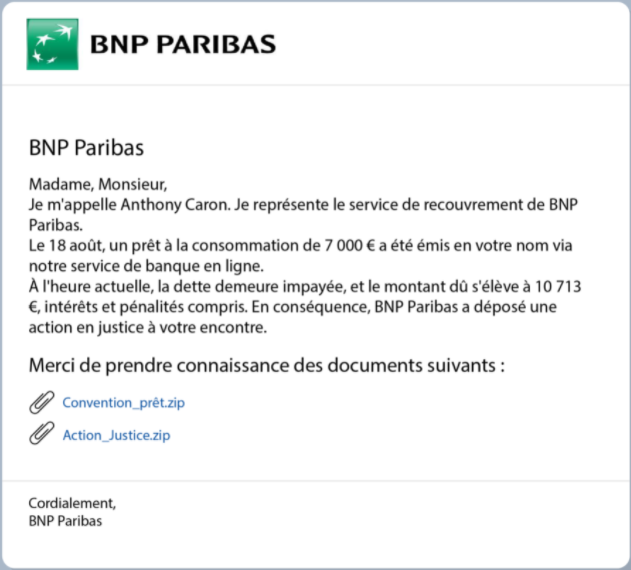
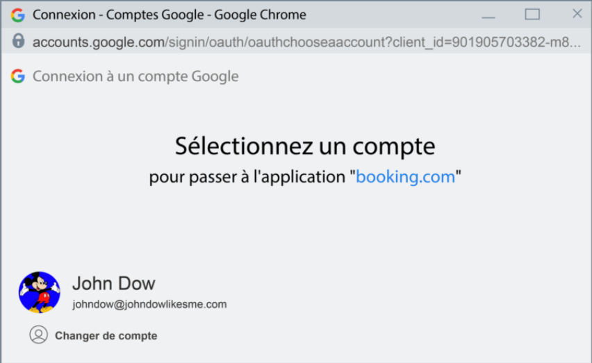

# Kaspersky

## Quels dangers menacent ma messagerie électronique ?

Les e-mails que nous recevons peuvent être différents les uns des autres : des échanges professionnels, des cartes postales, des courriers de services concernant la restauration de mots de passe ou l'inscription à un nouveau site, des newsletters, et même des e-mails que vous vous envoyez à vous-même pour vous souvenir d'informations importantes.

Parmi cette liste, on distingue une catégorie à caractère destructeur. Cette catégorie correspond aux e-mails d’hameçonnage.

### QU'EST-CE QUE L'HAMEÇONNAGE ?

Le terme hameçonnage vient, comme vous pouvez probablement le deviner, du terme hameçon. Il s'agit d'un type de fraude sur Internet dont le but est de recevoir de l'argent ou des informations confidentielles de la part d'utilisateurs.

En réalité, ces e-mails sont rédigés par des cybercriminels qui se font passer pour des employés de votre banque ou éventuellement vos collègues, tentant d'obtenir quelque chose de vous.

Ces e-mails ne sont autres que des hameçons. Le libellé de l'e-mail est l'appât, et vous êtes le poisson.

## OBJECTIFS DES CYBERCRIMINELS

### QUELLE EST LA TECHNIQUE DES CYBERCRIMINELS ?

Les cybercriminels profitent du fait qu'ils peuvent dissimuler tout ce qu'ils veulent dans un vaste flux de messages entrants. Ils travestissent ensuite leurs messages afin qu'ils paraissent sans danger.

Par exemple, les cybercriminels tentent de :

-   vous forcer à leur envoyer votre mot de passe et d'autres informations relatives à votre compte ;
-   vous inciter à installer un malware sur votre ordinateur, tel qu'un système de surveillance par webcam ;
-   vous soutirer des documents confidentiels liés à votre travail, tels que des états financiers, des informations sur les employés ou d'autres informations d'initié.

### COMMENT NE PAS SE FAIRE PIÉGER ?

Vous ne connaissez pas l'objectif final des cybercriminels. C'est pourquoi vous devez être prêt à repousser toutes leurs attaques.

## ECHNIQUES DES CYBERCRIMINELS

Les fraudeurs mettent au point diverses techniques pour vous tromper.

L'emploi d'un libellé manipulateur, comme dans le cas de messages vous menaçant de perdre de l'argent ou l'accès à un service important, ou vous incitant à faire quelque chose (envoyer un mot de passe ou des données) le plus rapidement possible sous prétexte que le temps presse, en est un exemple caractéristique.\
**Exemple:**

  

Quelle est la probabilité que vous croyiez cet e-mail et que vous ouvriez le fichier qu'il contient pour découvrir ce à quoi ce mystérieux prêt peut bien correspondre ?

### QUELS SONT LES AVANTAGES DES RÈGLES ET DES RECOMMANDATIONS PRÉSENTÉES DANS CE COURS ?

Les cybercriminels profitent avant tout de l'inattention des utilisateurs qui ne se posent pas la question de savoir si un e-mail est susceptible de constituer une menace.

Si vous avez conscience des conséquences susceptibles de découler de l'accès à un lien en apparence inoffensif contenu dans un e-mail ou de l'ouverture d'une pièce jointe, vous aurez une longueur d'avance sur les cybercriminels.

Vous êtes en mesure de protéger vos informations, données et comptes importants, de vous épargner des dépenses, une perte de temps et du stress, et de protéger votre organisation contre les complots de concurrents malhonnêtes.

## A apprendre

-   Vous apprendrez des règles simples qui vous permettront d'éviter d'être victime de vol ou de piratage de votre messagerie électronique.
-   Vous découvrirez quelles données peuvent être envoyées par e-mail et quelles données il est préférable de ne pas envoyer.
-   Vous apprendrez à reconnaître des e-mails frauduleux et à réagir de façon appropriée face à de tels e-mails.

# Que dois-je faire en cas de piratage de ma messagerie électronique ?

## POURQUOI EST-IL IMPORTANT DE PROTÉGER MA MESSAGERIE CONTRE LE PIRATAGE ?

En général, votre messagerie est votre identificateur principal sur le web. Presque tous les comptes importants sont reliés à la messagerie : les réseaux sociaux, les banques en ligne, les comptes d'autres services et sites internet.

La messagerie est la clé vers tout ce à quoi vous êtes connecté sur internet.

**LA RÈGLE\
Si vous pensez que quelqu'un tente de pirater votre compte, changez le mot de passe de votre messagerie immédiatement.**

## POURQUOI AI-JE BESOIN DE RÉINITIALISER MON MOT DE PASSE LE PLUS RAPIDEMENT POSSIBLE ?

Plus les auteurs de cyberattaques ont de temps, plus ils peuvent vous nuire. Que peuvent-ils faire ? Bien des choses !

-   Contactez des gens parmi vos contacts, notamment vos collègues, et demander de l'argent ou certaines données en votre nom.
-   Obtenir les mots de passe de vos autres comptes en utilisant votre messagerie.
-   Vous faire chanter, en vous demandant de l'argent en échange de la récupération de l'accès à votre messagerie.
-   Lire vos messages et en extraire des informations confidentielles pouvant être utilisées contre vous plus tard.
-   Utiliser votre compte pour des tentatives de hameçonnage et l'envoi de spams.
-   S'inscrire sur d'autres sites internet, notamment des sites illégaux, en utilisant votre e-mail.

## PIRATAGE DE LA MESSAGERIE DU CHEF DU PERSONNEL DE LA MAISON BLANCHE

### VIOLATION DES RÈGLES DE SÉCURITÉ

Au printemps 2016, les membres d'un groupe de cyberespionnage russe, le Fancy Bear, ont piraté le compte Gmail personnel de John Podesta, ancien chef du personnel de la Maison Blanche et directeur de la campagne présidentielle 2016 d'Hillary Clinton. L'attaque a été conduite par hameçonnage, c'est-à-dire que Podesta a cliqué sur un lien dans un e-mail ayant l'apparence d'une alerte de sécurité Google.

### QUE S'EST-IL PASSÉ

Les cybercriminels ont pu accéder à de nombreux e-mails et documents professionnels et les ont publiés sur WikiLeaks. Les e-mails contenaient les détails des conflits internes de la Clinton Foundation, ainsi que des slogans et discours potentiels de campagne. Ces informations ont provoqué des débats animés et ont été plusieurs fois mentionnées comme l'un des facteurs ayant contribué à la défaite de Clinton dans la course à la présidentielle.

### CONCLUSION

Cette histoire a eu des conséquences graves et montre l'importance de protéger ses e-mails professionnels.

### QUESTION

Un ami vous informe qu'il a reçu un e-mail suspect provenant de votre adresse. Vous vérifiez vos messages envoyés et ne retrouvez rien qui corresponde à la description. Votre mot de passe n'a pas été modifié, et vous avez toujours accès à vos autres comptes.

**Cela signifie-t-il que votre compte a été corrompu ?**

**OUI**.
Des cybercriminels ont accédé à votre adresse électronique et l'utilisent pour envoyer des spams ou commettre des fraudes. Modifiez votre mot de passe dès que possible !

## SIGNES DE TENTATIVE D'HAMEÇONNAGE

Maintenant passons à comment reconnaître un piratage. Les signes d'activités non-autorisées liées à votre messagerie peuvent être divisés en deux groupes. Le premier groupe couvre les signes de tentative de piratage. Cela signifie que nous ne sommes pas encore sûr de si le compte a été piraté ou non.

-   Vous avez reçu une notification de changement de mot de passe dans votre courrier indésirable.
-   L'autorisation d'envoi de SMS est activée dans les paramètres de messagerie et vous avez reçu un message avec un code pour vous connecter à votre messagerie.

### SIGNES DE PIRATAGE

Le second groupe compte les signes manifestes de piratage. Il y a quelqu'un d'autre qui parcourt vos e-mails.

-   Vous ne parvenez pas à vous connecter à votre messagerie. Votre mot de passe est reconnu comme étant erroné.
-   En vous connectant à votre messagerie, vous recevez une notification concernant un accès via un appareil inconnu, ou depuis l'IP d'un pays dans lequel vous ne vous trouvez pas actuellement.
-   Dans votre boîte de réception, vous trouvez des réponses à des e-mails que vous n'avez jamais envoyés. Certains messages ont disparu, l'affichage est différent de celui dont vous avez l'habitude, votre agenda contient des événements que vous n'avez pas prévu et il y a des gens que vous ne connaissez pas dans vos contacts. En bref, votre messagerie a connu une activité étrangère.

### QUELLE EST LA DIFFÉRENCE ?

Aussi étrange que cela puisse paraître, en termes de cybersécurité, il importe peu que la tentative de piratage ait réussi ou non. Au moindre doute quant à une attaque éventuelle de votre messagerie, vous devriez agir immédiatement.

### QUE DOIS-JE FAIRE SI JE SOUPÇONNE QUELQU'UN DE TENTER DE PIRATER MA MESSAGERIE ?

-   Si vous pouvez encore accéder à votre messagerie, changez immédiatement de mot de passe. Si vous avez utilisé ce même mot de passe ailleurs, changez ce-dernier également (bien que nous aimerions souligner que vous devriez utiliser des mots de passe différents sur vos différents sites).
-   Si vous n'avez plus accès à votre messagerie, restaurez cet accès en utilisant votre messagerie de secours ou une autre méthode proposée par votre service de messagerie (par exemple via l'envoi d'un code par SMS).
-   S'il s'agit d'une messagerie professionnelle, pour pouvoir accéder à nouveau à votre compte, contactez votre administrateur système. Ils pourront réinitialiser le mot de passe à distance et vous pourrez alors en créer un nouveau.
-   Changez les mots de passe de tous les services liés à cet e-mail. Par exemple, si vous disposez d'un compte sur un réseau social sur lequel vous vous êtes inscrit avec cette adresse mail, changez le mot de passe de ce compte. Si cette adresse est celle que vous utilisez pour votre compte bancaire en ligne, changez également ce mot de passe.
-   S'il s'agit de votre adresse email professionnelle, vous devez en informer l'équipe de sécurité informatique de votre entreprise. Vous devez également leur signaler que votre adresse email personnelle a été piratée si vous l'avez utilisée à des fins professionnelles.

### POURQUOI DEVRAIS-JE SIGNALER LE PIRATAGE DE MA MESSAGERIE PERSONNELLE AU SERVICE CYBERSÉCURITÉ ?

-   Même si votre adresse email personnelle a été piratée, il est possible que vous ayez été ciblé précisément en raison de votre lieu de travail, et que la cible principale soit votre entreprise. Par conséquent, si vous utilisez votre adresse email personnelle à des fins professionnelles (par exemple, pour transmettre des informations commerciales), vous devez signaler tout incident à l'équipe de sécurité informatique de votre entreprise.
-   Après avoir eu accès à vos messages, les cybercriminels peuvent poursuivre leur attaque en ciblant vos collègues. En remontant les maillons de cette chaîne, ils sont en mesure d'accéder aux informations confidentielles de l'entreprise ou au compte d’un haut dirigeant. Les conséquences d'une telle attaque vous impacteront également et vous pourrez même être licencié.

### COMMENT PUIS-JE RENDRE MA MESSAGERIE PLUS COMPLEXE À PIRATER ?

-   Paramétrez le système de façon à ce qu'en plus de saisir votre mot de passe principal, vous deviez saisir un mot de passe temporaire (un code) que vous recevez par message sur votre téléphone.
-   Suivez les règles de création de mot de passe : prolongez-le et rendez le plus complexe.
-   Modifiez régulièrement les mots de passe de votre messagerie et des comptes qui y sont rattachés.
-   Utilisez différents mots de passe pour vos différents comptes.
    -   Un pour votre messagerie personnelle
    -   et un autre pour votre messagerie professionnelle,
    -   encore un autre pour votre banque en ligne, etc.

### COMMENT CELA ARRIVE

#### EXEMPLE FRAPPANT D'UN PIRATAGE DE MESSAGERIE

La journaliste politique britannique Rowenna Davis a été victime d'un cas marquant il y a de cela un moment, en 2011. En dépit du temps passé, ce cas est toujours un exemple classique des conséquences d'un piratage de messagerie

#### QU'EST-CE QUE LE CYBERCRIMINEL A FAIT

Le cybercriminel est parvenu à accéder à son compte, à changer le mot de passe et est passé à l'action. Au départ, il lui demandait 585 € en échange de la récupération de sa messagerie, puis il envoya une demande d'aide financière à 5 000 personnes parmi les contacts de Rowenna, en son nom à elle mais avec ses coordonnées bancaires à lui.

#### QUELLE EST L'ERREUR DU JOURNALISTE ?

Enfin, toutes les correspondances de la journaliste ont été publiées par l'auteur de l'attaque. Davis a déclaré que le fournisseur de service, Google, ne lui a pas apporté l'assistance attendue pour lui permettre de récupérer sa messagerie et qu'elle n'avait pas pris la peine de créer une messagerie de secours pouvant l'aider à réinitialiser son mot de passe.

### CONCLUSION

Au moindre soupçon de piratage de votre adresse email :

-   récupérez l'accès à votre compte et modifiez le mot de passe ;

-   modifiez les mots de passe des services liés ;

-   informez l'équipe de sécurité informatique de votre entreprise (s'il s'agit de votre adresse email professionnelle ou personnelle utilisée à des fins professionnelles).

## À quoi dois-je prêter attention lorsqu'il m'est demandé de saisir le mot de passe de ma messagerie électronique ?

**LA RÈGLE**\
Vous pouvez saisir le mot de passe de votre messagerie électronique :

-   sur le site Web du service de messagerie électronique ;
-   dans l'application mobile du service de messagerie électronique ;
-   dans un logiciel de messagerie électronique de bureau ;
    et nulle part ailleurs

### QU'EST-IL SUSCEPTIBLE DE SE PASSER SI JE SAISIS LE MOT DE PASSE DE MA MESSAGERIE ÉLECTRONIQUE SUR UN SITE TIERS ?

D'ailleurs, si quelqu'un vous envoie un lien vers le serveur de messagerie (via messenger, par exemple), vous ne devez pas suivre ce lien.

Connectez-vous à votre messagerie électronique directement et saisissez-y le mot de passe.

**Si un site Web vous demande de saisir le mot de passe de votre compte de messagerie électronique, soyez certain qu'il s'agit d'une arnaque. N'y saisissez rien et partez.**

### DANS QUELS CAS NE DOIS-JE PAS SAISIR LE MOT DE PASSE DE MA MESSAGERIE ÉLECTRONIQUE ?

Les cybercriminels peuvent tenter de voler votre mot de passe de différentes façons. En voici quelques-unes :

-   En vous demandant de saisir l'adresse et le mot de passe de votre messagerie électronique ailleurs que sur le site officiel de messagerie, dans l'application de messagerie ou au sein de l'interface du logiciel de messagerie.
-   En vous envoyant un e-mail dans lequel il vous est demandé de confirmer le mot de passe de votre messagerie électronique via un champ destiné à la saisie du mot de passe ou un lien vers un autre site contenant un champ à cet effet.
-   Via des fenêtres contextuelles ou intégrées contenant des champs destinés à la saisie de l'identifiant et du mot de passe de votre messagerie électronique.

Vous ne devez saisir votre mot de passe dans aucun de ces cas.

### CONNEXION À L'AIDE DE LA MESSAGERIE ÉLECTRONIQUE : CE QUE VOUS DEVEZ VÉRIFIER AVANT DE SAISIR VOS DONNÉES

Il arrive qu'un service tiers, par exemple un site Web de vente de billets d'avion, vous propose de vous connecter à l'aide de votre compte de messagerie électronique sans vous inscrire.

Si vous acceptez, une fenêtre contenant un formulaire de connexion s'ouvrira, et vous devrez y saisir l'adresse et le mot de passe de votre messagerie électronique.

  

Soyez prudent dans de tels cas. Consultez l'adresse de la fenêtre qui s'est ouverte et assurez-vous qu'il s'agit bien du site Web de votre service de messagerie électronique, Gmail par exemple. Il est facile pour les cybercriminels d'imiter ce type de fenêtres.

### EXISTE-T-IL DES EXCEPTIONS ?

#### LES SERVICES LIÉS À UNE MESSAGERIE ÉLECTRONIQUE

Il existe des services liés directement à votre compte de messagerie électronique. Par exemple, Google Play, YouTube et autres ressources appartenant à Google sont liés à Gmail.

Vous pouvez accéder à ces services en vous connectant à un seul compte Google à l'aide d'un mot de passe commun à tous. Les services Amazon suivent un principe semblable. Par exemple, Amazon AWS, Amazon shopping et Amazon Prime Video sont liés à un même compte Amazon.

#### QUE FAUT-IL POUR SE CONNECTER ?

Lorsque vous vous connectez à l'un de ces services quelconque, le système vous demande le mot de passe de votre compte Google. Il convient de noter que le système demande de saisir le mot de passe d'un compte précis.

S'il vous est demandé de saisir un "mot de passe de messagerie électronique", il est fort probable que vous soyez sur une fausse page Web. Les cybercriminels ne peuvent pas connaître le nom de votre compte à l'avance, ils essaient donc d'obtenir l'un quelconque de vos mots de passe.

#### CONCLUSION

Soyez prudent et vérifiez que le site Web sur lequel vous saisissez votre mot de passe est authentique, en consultant l'URL.

**N'oubliez pas : vous devez saisir le mot de passe de votre messagerie électronique uniquement sur le site Web du service de messagerie, dans l'application mobile de messagerie ou au sein du logiciel de messagerie de bureau.**

Vous avez besoin du mot de passe de votre messagerie électronique uniquement pour vous connecter à votre messagerie et aux services liés à celle-ci.

## Quels types de données est-il déconseillé d'envoyer par e-mail ?

**LA RÈGLE**\
Ne jamais envoyer par e-mail votre mot de passe ou les coordonnées de votre carte bancaire, autres que les chiffres qui se trouvent devant.

### POURQUOI NE DOIS-JE PAS ENVOYER DE MOTS DE PASSE PAR E-MAIL ?

Nous vous rappelons que vous ne devriez jamais communiquer à personne vos mots de passe. C'est une règle universelle dont nous avons parlé dans le chapitre « Mots de passe ».

Envoyer votre mot de passe revient à la même chose que de le dire, vous devriez donc éviter.

### QUELLES DONNÉES EST-IL DANGEREUX D'ENVOYER PAR E-MAIL ?

Il s'agit des données suivantes :

-   Informations relatives à votre identité ;
-   Numéro d'assurance ou d'identification fiscale ;
-   Copies de la carte grise et du certificat d'assurance de votre véhicule ;
-   Dossier médical ;
-   Certificat de propriété ;
-   Extraits de naissance des enfants ;
-   Les documents concernant vos impôts, etc.

### EST-IL SANS DANGER D'ENVOYER DES DOCUMENTS IMPORTANTS PAR E-MAIL ?

Assez curieusement, il n'est pas dangereux d'envoyer la plupart des documents suivants par e-mail et dans certains cas c'est même préférable.
Par exemple :

-   Vous pourriez avoir besoin d'envoyer par e-mail une copie numérique de votre pièce d'identité ou votre numéro d'identification fiscal pour un contrat d'embauche ;
-   Votre dossier médical pourrait être transmis à votre médecin généraliste par un laboratoire indépendant ;
-   Une banque pourrait vous demander une attestation de salaire pour l'ouverture d'un compte.
    Etc.

Le plus important, c'est de respecter les règles de sécurité lorsque vous envoyez des documents.

### COMMENT TRANSMETTRE UN NUMÉRO DE CARTE BANCAIRE DE FAÇON ADÉQUATE ?

Vous rédigez un article pour un magazine en ligne. Vous avez l'habitude de communiquer avec la directrice, Marie, vous lui avez même déjà envoyé le texte finalisé.

Vous recevez ensuite un e-mail de Victoire Dubois qui prétend être la comptable du magazine, elle vous demande de lui transmettre le numéro de votre carte bancaire afin qu'elle puisse vous payer.

Appeler Marie et vérifier que Victoire Dubois travaille bien pour le service de comptabilité du magazine.
Si c'est vrai, lui renvoyer un e-mail contenant le numéro sur la face avant de votre carte bancaire.
En d'autres termes, vous avez vérifié que le destinataire est bien une vraie personne (Victoire travaille effectivement pour le magazine) et que la demande est légitime (elle est bien comptable). Vous avez fait ce qu'il faut.

### DONNÉES : À NE PAS ENVOYER

Outre le numéro, il y a d'autres données de carte bancaire :

La date d'expiration de la carte : le mois et l'année jusqu'à laquelle la carte est valide.

Le titulaire de la carte : votre nom et votre prénom.

Le code de sécurité ou de vérification (code CVV/CVC) (au dos de la carte) : code d'authentification de la carte, numéro à trois chiffres correspondant au numéro de la carte dans la base de données du système (Visa ou MasterCard par exemple). Lorsque vous payez sur Internet, ce code permet une confirmation supplémentaire du fait que vous êtes bien en possession de cette carte à ce moment précis.

### POURQUOI

Vous ne devriez jamais communiquer ces informations à personne.

Vous êtes la seule personne qui doive en avoir connaissance. Vous ne devez indiquer le nom du titulaire de la carte, sa date d'expiration et le code de vérification (CVV) que lorsque vous réalisez un achat sur Internet pour l'authentification de la carte. Si quelqu'un souhaite vous envoyer de l'argent, il peut vous demander le numéro de votre carte. S'il vous demande quoi que ce soit d'autre, cela signifie qu'il souhaite vous voler de l'argent.

C'est la raison pour laquelle vous ne devriez jamais envoyer une photo ou une copie numérique de votre carte bancaire à personne, car toutes les autres informations en plus du numéro y sont visibles.

### SI ON RECOIT UN MAIL DE NOTRE BANQUE INVITANT A ENVOYER LES INFROMATIONS DE NOTRE CARTE BANCAIRE

Cet e-mail ne provient pas de la banque, mais plutôt de cybercriminels. Vous devriez le signaler comme spam, cela permettra au service de messagerie électronique d'analyser le message et de transférer automatiquement les messages similaires dans le dossier « Spams ». Aucune banque ne vous demandera jamais les coordonnées de votre carte bancaire. Vous ne devriez pas répondre à ce genre d'e-mails et, bien sûr, vous ne devriez pas communiquer vos coordonnées ni via le formulaire, ni dans un e-mail de réponse.

Nous vous déconseillons également d'appuyer sur le bouton « Se désinscrire » dans ce genre d'e-mails. Cela pourrait vous mener vers un site frauduleux. Vous ne devriez-vous désinscrire que des ressources que vous connaissez.

### QUE POURRAIT-IL SE PASSER SI JE NE RESPECTAIS PAS TOUTES CES RÈGLES ?

-   Grâce aux données de votre carte bancaire, un cybercriminel pourrait réaliser des achats sur Internet.
-   Dans certains pays, avec une copie numérique de votre pièce d'identité, une personne mal intentionnée peut acheter un nouveau téléphone à votre nom auprès d'un opérateur de téléphonie mobile et contracter un abonnement que vous devrez payer.
-   Dans certains pays, grâce à votre titre de propriété n'importe qui peut louer illégalement votre appartement à un inconnu.
-   Et pour finir, des personnes mal intentionnées pourraient tout simplement vous faire chanter en vous menaçant de communiquer vos informations confidentielles (d'ordre médical par exemple) à des personnes qui ne sont pas censées les connaître.

### QUE POURRAIT-IL SE PASSER SI JE NE RESPECTAIS PAS TOUTES CES RÈGLES ?

Les cybercriminels sont très rusés.

Ils trouvent toujours un moyen d'utiliser vos documents.

Ne leur donnez pas une occasion de le faire.

### CONCLUSION

-   Vous devriez faire attention lorsque vous envoyez des documents par e-mail et vous devriez les supprimer du dossier correspondant après l'envoi.
-   Vous ne devriez envoyer aucune information concernant votre carte bancaire par e-mail, sauf le numéro qui se trouve sur la face avant (et uniquement si vous faites confiance au destinataire).

## Quels e-mails sont dangereux et comment les détecter ?

**LA RÈGLE**\
Étudier minutieusement chaque e-mail et ignorer ceux qui sont suspects.

### POURQUOI ÉTUDIER MINUTIEUSEMENT CES E-MAILS ?

Les cybercriminels essaient de se faire passer pour des gens de confiance.

En usurpant l'identité de vos amis et de vos collègues, ils essaient de vous faire faire des choses qui finissent par avoir des conséquences fâcheuses (de la perte de l'accès à votre compte de messagerie électronique à une attaque de grande ampleur visant votre entreprise).

### QU'ATTENDENT LES CYBERCRIMINELS LORSQU'ILS S'EN PRENNENT À MOI ?

Les cybercriminels ont toujours le même but, soutirer de l'argent (il peut arriver qu'on ait aussi affaire à de simples fauteurs de trouble mais c'est plus rare). Il y a plusieurs façons de soutirer de l'argent, voler et extorquer, vendre des informations, etc. Grâce à votre compte de messagerie électronique, un criminel peut obtenir :

-   Les coordonnées de votre carte bancaire, pour vous voler de l'argent.
-   L'accès à vos comptes pour envoyer des spams ou des e-mails d'hameçonnage à vos amis et à vos connaissances en votre nom.
-   Des informations confidentielles et des photos pour vous faire chanter.
-   Les données et les documents internes de votre entreprise pour les vendre à des concurrents.
-   L'accès à votre compte professionnel pour étendre l'attaque à la société et à ses partenaires.
-   Toute autre donnée. En effet, les criminels peuvent utiliser n'importe quoi tant que ça leur est bénéfique. On ne sait jamais à quoi s'attendre de leur part.

### POUR QUI LES CYBERCRIMINELS PEUVENT-ILS SE FAIRE PASSER ?

Pour n'importe qui. Nous n'allons vous lister que les scénarios les plus communs.

-   Votre collègue ou votre patron. Sous cette couverture le criminel peut demander des documents professionnels importants, un accès au réseau interne, des données confidentielles de clients, etc. Généralement les cybercriminels ont recours à ce genre de couverture lors d'attaques ciblant des entreprises.
-   Un ami ou une connaissance. Dans ce cas précis, ils peuvent vous demander de leur prêter de l'argent ou récupérer certaines de vos informations personnelles pour faire chanter par la suite.
-   Une banque, une boutique, une compagnie aérienne ou le membre du comité d'un prix littéraire, en fait, tout membre de tout organisme ou société avec laquelle vous pourriez être en contact. En se faisant passer pour un employé de banque, ils essaieront de vous soutirer les coordonnées de votre carte bancaire et le code secret, et en se faisant passer pour l'employé d'une compagnie aérienne, ils pourraient essayer de récupérer les informations apparaissant sur votre passeport.
-   Un membre d'un organisme ou d'une société dont vous n'avez jamais entendu parler, une société qui organise des tirages au sort part exemple. Ils prétexteront une grosse somme d'argent que vous êtes supposé(e) avoir gagné pour essayer de vous soutirer des informations ou de l'argent.

**Il s'agit d'un e-mail suspect : il est très peu probable qu'une réunion avec un client soit organisée si hâtivement que le chef de projet n'a même pas le temps de réunir tous les documents nécessaires. De plus, en pareille situation, les gens privilégient plutôt les appels aux e-mails.**
**Par ailleurs, l'expéditeur possède une adresse e-mail suspecte sur un domaine gratuit (gmail.com) plutôt que sur le domaine d'une agence.**
**Jean doit déplacer ce courrier dans ses spams et s'il a toujours un doute, il doit appeler le chef de projet en personne pour vérifier.**

### QUELLES SONT LES MÉTHODES UTILISÉES PAR LES CYBERCRIMINELS ?

-   Ils se jouent de nous en essayant de nous faire suivre des liens. Leurs liens ont l'air le plus vrai possible. Ils semblent mener vers le site Internet d'une banque ou d'un boutique en ligne, vers le compte d'un ami sur un réseau social, ou vers une plate-forme pour effectuer un don à une œuvre caritative.

En réalité, les liens des cybercriminels vous mènerons n'importe où, mais certainement pas où vous pensez. Par exemple, ils pourraient vous mener vers de faux comptes sur les réseaux sociaux sur lesquels vous indiquerez votre mot de passe sans vous rendre compte que le site est frauduleux et ce mot de passe tombera entre les mains de criminels. Vous pourriez également vous retrouver à télécharger un malware capable de lire les données que vous saisissez sur votre clavier.

-   Ils vous proposent de remplir un formulaire.

Pour confirmer par exemple votre compte en saisissant le mot de passe et l'identifiant de connexion au réseau de votre entreprise à l'intérieur d'un formulaire se trouvant dans le corps du texte de l'e-mail. Ou pour payer quelque chose en indiquant les coordonnées de votre carte bancaire.

Comme vous l'avez sans doute deviné, tout ce que vous indiquez dans ce formulaire tombe directement entre les mains de criminels.

-   Ils vous proposent de télécharger la pièce jointe d'un e-mail.

Ces pièces jointes sont généralement des fichiers exécutables. En les exécutant sur votre ordinateur, vous installerez des malwares.

À première vue, les pièces jointes des cybercriminels semblent parfaitement sécurisées, elles prennent la forme de documents MS Office ou de fichiers audio.

-   Ils utilisent l'ingénierie sociale, pour vous convaincre de leur envoyer votre argent ou vos données. Les cybercriminels maîtrisent la psychologie et savent quels sont les arguments qui fonctionnent le mieux.

Les plus célèbres parmi ce genre d'e-mails sont ceux censés provenir du Nigeria. C'est toujours le même scénario, l'héritier d'une grande fortune ne peut en prendre possession pour certaines raisons, il ou elle vous demande donc votre aide en échange d'un pourcentage de la somme (généralement quelques millions de dollars américains). En réalité, ils essaient de vous soutirer une petite somme d'argent (entre 100 et 500 dollars).

### SOYEZ VIGILANT !

À peine un dixième de toutes les méthodes et arnaques utilisées par les cybercriminels apparaissent dans la liste ci-dessus. Dans le cours suivant, nous nous intéresserons plus en détail au processus de vérification des liens et des adresses utilisées pour l'envoi des e-mails, ainsi qu'aux signes caractéristiques qui se cachent dans ces e-mails.

Pour le moment, retenez la règle principale, **soyez vigilant !**

Faites attention à tous les e-mails provenant d'inconnus. Pareil pour les e-mails suspects ou étranges provenant de personnes que vous connaissez.

### Conséquences

-   Conséquences personnelles. Vous ferez partie des victimes des cybercriminels, vous perdrez de l'argent de votre compte bancaire ou l'accès à vos données personnelles (les cybercriminels les chiffreront afin de vous demander une rançon). Vous perdrez le contrôle de vos profils sur les réseaux sociaux ou de vos comptes de messagerie électronique.

-   Conséquences professionnelles. Vous deviendrez complice d'un crime contre votre entreprise, si des cybercriminels utilisent par exemple vos données pour avoir accès aux informations confidentielles de la société. Vous pourriez vous retrouver à perdre votre emploi, voire à être poursuivi en justice.

### CHOSES DANGEREUSES

Ignorez tout e-mail formulé comme une incitation à faire quelque chose en particulier, s'il vous est demandé de faire quoi que ce soit susceptible de représenter un danger pour vous, votre réputation et votre entreprise.\
Les choses suivantes sont considérées comme dangereuses :

-   Transmettre ses données ;
-   Envoyer de l'argent ;
-   Ouvrir des pièces jointes ;
-   Installer des applications ;
-   Suivre des liens vers des sites (lorsque vous le faites, les malwares se téléchargent tous seuls depuis votre navigateur).

### COMMENT ANALYSER UN E-MAIL ?

Si vous recevez un e-mail contenant des instructions, analysez scrupuleusement son contenu.

### CONCLUSION

-   Tout e-mail provenant de quelqu'un que vous ne connaissez pas est potentiellement dangereux.
-   Vérifiez minutieusement vos e-mails si vous remarquez la moindre tentative de manipulation ou demande d'action.

# Les logiciels malvails

## Comment reconnaitre les sites malvails
**LA RÈGLE**\
Rappelez-vous qu'absolument n'importe quel site peut être malveillant, alors faites attention aux signes qui le trahissent.\
Si vous accédez accidentellement à un site présentant des signes de logiciels malveillants, fermez-le immédiatement.

D'une manière générale, tous les moteurs de recherche ont la capacité intégrée d'avertir l'utilisateur de la présence de sites malveillants. Par exemple, Google reconnaît plusieurs types de danger et affiche différents avertissements. Si le site est clairement un site de phishing, Google indique « Attention, faux site ! », et s'il risque d'essayer d'installer un logiciel malveillant sur votre ordinateur, Google avertit que le « site contient des programmes nuisibles ».

Vous n'avez pas tort : toutes les réponses sont correctes.

Vous devez prendre au sérieux les avertissements de tout navigateur, moteur de recherche ou antivirus et quitter immédiatement le site en question.

CONCLUSION\
Les sites peu sûrs présentent de nombreux signes extérieurs. Faites attention et ne croyez pas aux ruses des escrocs.\
Si un navigateur, un antivirus ou un moteur de recherche vous avertit d'un danger, quittez le site immédiatement. Les avertissements directs ne doivent pas être ignorés.

**LA RÈGLE**\
Lorsque vous avez besoin de certains programmes ou applications, installez-les uniquement à partir du site officiel du développeur.

L'utilisation de sites officiels et de distributeurs légaux est un moyen garanti de ne rien télécharger qui puisse nuire à votre ordinateur.

Si vous souhaitez installer un nouveau programme sur votre ordinateur personnel, vous devez procéder comme suit :
- trouver le site officiel du développeur ou du distributeur de logiciels ;
- télécharger le logiciel ;
- installer le logiciel ;

Aussi étrange que cela puisse paraître, c'est exact. La page Wikipédia contiendra un lien direct vers le site du développeur.

La règle générale est la suivante : vous devez rechercher les sites officiels par le biais d'un moteur de recherche. Les sites officiels figurent généralement parmi les cinq premiers résultats de recherche. Nous tenons à souligner qu'ils ne sont pas nécessairement les premiers. Parfois, les distributeurs non officiels optimisent mieux leurs sites, ce qui leur permet d'être mieux référencés que le site officiel. Toutefois, la différence n'est jamais grande : une à deux positions d'écart.

Ne cliquez jamais sur les liens sponsorisés dans les résultats des moteurs de recherche.

Un bon moyen de trouver un site officiel est d'y accéder à partir de Wikipédia.

À la fin de l'article ou dans la colonne d'information à droite, on peut toujours trouver un lien vers le site officiel du logiciel dont il est question dans l'article. Contrairement aux idées reçues, les modérateurs de Wikipédia travaillent rapidement, et même si un cybercriminel tente de remplacer le lien par le sien, le changement sera détecté et résolu dans un délai de 15 à 20 minutes.

Techniquement, il existe un type de fraude relativement rare connu sous le nom d'attaques contre la chaîne d'approvisionnement. Il s'agit de l'injection de code malveillant dans le logiciel au stade du développement par des pirates informatiques. Ensuite, lorsque le logiciel est diffusé, les pirates informatiques peuvent l'utiliser à leurs propres fins, par exemple pour voler des informations. Toutefois, il n'y a rien à faire dans ce cas : si un tel code est intégré dans un programme, la version infectée se retrouvera sur le site officiel et partout ailleurs également.

En revanche, si vous n'êtes pas certain que le programme a été obtenu auprès d'une source fiable, vous devez suivre ces deux mesures de sécurité au moment de le lancer.
- Premièrement, maintenez toujours votre logiciel antivirus activé et vérifiez le fichier du programme séparément. Si celui-ci est infecté par un virus, l'antivirus le détectera.
- Deuxièmement, ne désactivez pas votre pare-feu habituel ni le contrôle de compte d'utilisateur du système d'exploitation. Lorsque vous exécutez un fichier EXE, le système d'exploitation vous demande si vous autorisez ce programme à apporter des modifications au système.\
Cette fenêtre indique toujours l'éditeur du programme. Si l'éditeur est inconnu, il ne convient pas d'installer le programme, car vous n'avez aucune idée de ce qui se passera par la suite. Il y a de fortes chances qu'il s'agisse d'un logiciel malveillant.\
Il convient de noter que les programmes peuvent parfois être contrefaits ou piratés de manière très professionnelle et inclure un éditeur. Toutefois, la mention « inconnu » indique la présence d'une menace dans 99 % des cas.

Si Alex avait l'intention d'installer Movavi sur son ordinateur personnel, il pourrait télécharger le programme à partir du site officiel : movavi.fr.

Toutefois, comme il s'agit de son ordinateur portable de travail, il ne devrait pas installer de programmes par lui-même. Il doit contacter le service informatique de son entreprise, qui installera tout ce dont il a besoin.

CONCLUSION
- Si vous avez besoin de télécharger un logiciel sur votre ordinateur de travail, contactez le service informatique de votre entreprise.
- Si vous avez besoin de télécharger un logiciel sur votre ordinateur personnel, trouvez le site officiel du programme ou du développeur et téléchargez le fichier d'installation à cet endroit.
- Si vous essayez de télécharger un logiciel à partir d'un site non officiel, dans le meilleur des cas, vous perdrez votre temps et vous vous retrouverez sans rien, mais dans le pire des cas, vous installerez un logiciel malveillant sur votre ordinateur.

## Télécharger de fichiers en ligne
**LES RÈGLES**\
- Vérifiez toujours l'extension du fichier lorsque vous téléchargez de la musique, des vidéos, des livres et des documents en ligne.
- Analysez chaque fichier téléchargé à l'aide d'un logiciel antivirus.

La règle principale à suivre lors de la recherche de fichiers en ligne est simple : n'utilisez que des sources connues et vérifiées.

Vous avez besoin d'un nouveau film ? Regardez-le sur Netflix, Amazon Prime Video ou tout autre service de streaming légal.
Vous avez besoin d'un nouveau livre numérique ? Téléchargez-le sur Amazon ou auprès d'un autre revendeur de livres numériques.
Vous cherchez le nouvel album de Billy Eilish ? Consultez la bibliothèque d'iTunes, l'album y est sûrement proposé.
Vous avez besoin d'un article écrit par un professeur de l'université Paris-Sorbonne ? Trouvez-le sur le site Web de l'université ou adressez-vous directement au professeur en question.
En utilisant des sources bien connues et vérifiées, vous vous assurez de ne rien télécharger de malveillant.

CONCLUSION
Vérifiez toujours l'extension du fichier que vous vous apprêtez à télécharger. Elle doit correspondre à ce que le fichier est censé être.
Essayez toujours de télécharger des fichiers provenant de sources officielles : services légaux de streaming de vidéo et de musique, sites universitaires, etc.
Juste au cas où, analysez chaque fichier téléchargé avec un logiciel antivirus.

## Comment installer correctement des extensions de navigateur ?
RÈGLE N° 1
Installez des extensions uniquement à partir du menu ou de la boutique officielle du navigateur.

CONCLUSION
Réduisez le nombre de plugins que vous utilisez et n'oubliez pas de supprimer les extensions dont vous n'avez pas besoin.
Téléchargez les extensions uniquement à partir des boutiques officielles des navigateurs. Lorsque vous choisissez les extensions à télécharger, faites attention au nombre de téléchargements, aux notes ainsi qu'au nombre et à la qualité des commentaires.
Mettez régulièrement à jour vos extensions.